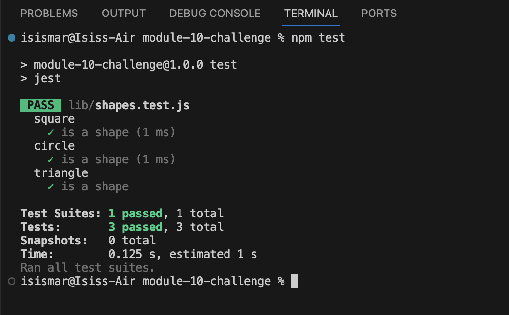
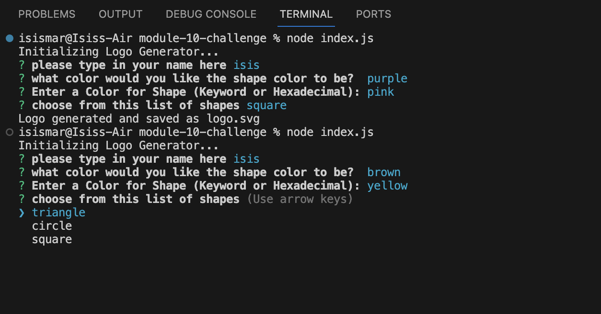

# module-10-challenge
starting up a logo that has a color, shape, etc... runing a command line in node.js

## Description:
This application allows the user to create a simple logo.svg file which generates a logo using the shapes: square, circle, triangle.

# Overview

## Challenge:
Your task is to build a Node.js command-line application that takes in user input to generate a logo and save it as an SVG file Links to an external site.. The application prompts the user to select a color and shape, provide text for the logo, and save the generated SVG to a .svg file.

## Walk through video
https://drive.google.com/file/d/1M7HaNiRHtU-JW85L8QktHHNJBNLzeS5e/view?usp=drive_link 

## USER STORY: 
AS a freelance web developer
I WANT to generate a simple logo for my projects
SO THAT I don't have to pay a graphic designer

## Acceptance Criteria:
GIVEN a command-line application that accepts user input
WHEN I am prompted for text
THEN I can enter up to three characters
WHEN I am prompted for the text color
THEN I can enter a color keyword (OR a hexadecimal number)
WHEN I am prompted for a shape
THEN I am presented with a list of shapes to choose from: circle, triangle, and square
WHEN I am prompted for the shape's color
THEN I can enter a color keyword (OR a hexadecimal number)
WHEN I have entered input for all the prompts
THEN an SVG file is created named `logo.svg`
AND the output text "Generated logo.svg" is printed in the command line
WHEN I open the `logo.svg` file in a browser
THEN I am shown a 300x200 pixel image that matches the criteria I entered

## Usage:

1. Open integrated terminal on index.js
Enter “node index.js” in the command line
2. Type in - node index.js
3. Answer all questions that you are prompted with. Answering these questions will generate the logo for you.
4. Once questions has been answered, navigate to "logo.svg" under the folder "tests". Right click on "logo.svg" and click on "open preview"

# Screenshots:

1.  -- Jest test "npm test"
2.  -- Command Line

## Installation Process:

1.  "jest": "^29.7.0",
2.  "inquirer": "^8.2.4",
3.  "node": ">=6.9.0"

## License and Copyright

MIT License

Copyright (c) [2024] [Isis Martinez]

Permission is hereby granted, free of charge, to any person obtaining a copy
of this software and associated documentation files (the "Software"), to deal
in the Software without restriction, including without limitation the rights
to use, copy, modify, merge, publish, distribute, sublicense, and/or sell
copies of the Software, and to permit persons to whom the Software is
furnished to do so, subject to the following conditions:

The above copyright notice and this permission notice shall be included in all
copies or substantial portions of the Software.

THE SOFTWARE IS PROVIDED "AS IS", WITHOUT WARRANTY OF ANY KIND, EXPRESS OR
IMPLIED, INCLUDING BUT NOT LIMITED TO THE WARRANTIES OF MERCHANTABILITY,
FITNESS FOR A PARTICULAR PURPOSE AND NONINFRINGEMENT. IN NO EVENT SHALL THE
AUTHORS OR COPYRIGHT HOLDERS BE LIABLE FOR ANY CLAIM, DAMAGES OR OTHER
LIABILITY, WHETHER IN AN ACTION OF CONTRACT, TORT OR OTHERWISE, ARISING FROM,
OUT OF OR IN CONNECTION WITH THE SOFTWARE OR THE USE OR OTHER DEALINGS IN THE
SOFTWARE.